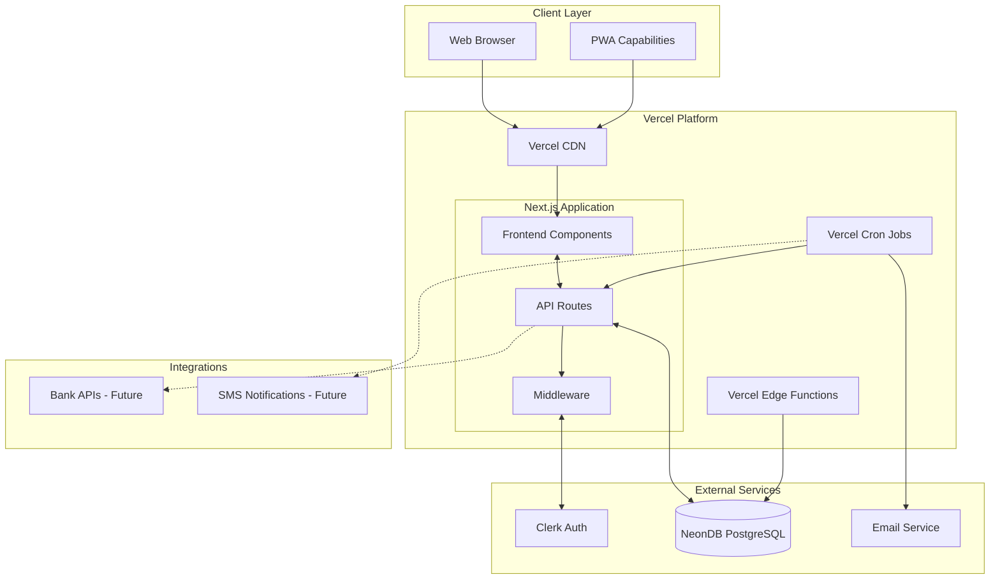

# SalaryMan Fullstack Architecture Document

## Introduction

This document outlines the complete fullstack architecture for SalaryMan, including backend systems, frontend implementation, and their integration. It serves as the single source of truth for AI-driven development, ensuring consistency across the entire technology stack.

This unified approach combines what would traditionally be separate backend and frontend architecture documents, streamlining the development process for modern fullstack applications where these concerns are increasingly intertwined.

### Starter Template or Existing Project

**Current State:** Existing Next.js 15 project with basic setup already initialized.

**Existing Dependencies Analysis:**
- **Next.js 15.4.6** - Latest version, excellent foundation for fullstack development
- **React 19.1.0** - Latest React version with concurrent features
- **TypeScript 5.x** - Latest TypeScript for enhanced type safety
- **Tailwind CSS v4** - Latest version with new architecture
- **Shadcn UI Components** - Partial setup with class-variance-authority, clsx, lucide-react

**Missing Dependencies for Financial App:**
- Authentication: Clerk integration needed
- Database: Drizzle ORM and NeonDB connection
- Validation: Zod for type-safe API boundaries
- Financial-specific utilities: Currency formatting, date handling

**Architectural Constraints:**
- Must maintain existing Next.js 15 App Router structure
- Leverage existing Tailwind v4 and component foundation
- Build upon current TypeScript configuration
- Integrate financial features within established patterns

### Change Log

| Date | Version | Description | Author |
|------|---------|-------------|---------|
| 2025-08-10 | 1.0 | Initial fullstack architecture creation | Winston (Architect) |

## High Level Architecture

### Technical Summary

SalaryMan employs a modern **Jamstack architecture** with **Next.js 15 App Router** serving as both frontend framework and serverless backend via API routes. The application leverages **server-side rendering** and **static generation** for optimal performance while maintaining **real-time financial data** capabilities. **NeonDB PostgreSQL** provides robust financial data storage with **Drizzle ORM** ensuring type-safe database operations. **Clerk authentication** handles user security and session management, while **Vercel deployment** enables global edge distribution. This architecture achieves PRD goals through scalable serverless functions, automated financial alerts, and responsive user interfaces optimized for comprehensive personal finance management.

### Platform and Infrastructure Choice

**Platform:** Vercel + NeonDB + Clerk Ecosystem
**Key Services:** 
- Vercel Edge Functions for API routes and serverless compute
- NeonDB PostgreSQL for primary data storage with connection pooling
- Clerk for authentication, user management, and session handling  
- Vercel Analytics for performance monitoring
- Vercel Cron Jobs for automated alerts and recurring payment detection

**Deployment Host and Regions:** 
- Primary: Vercel Global Edge Network (auto-scaled)
- Database: NeonDB Multi-region with primary in US-East
- CDN: Vercel Edge Network with global distribution

**Rationale:** This platform combination provides optimal developer experience while meeting enterprise-grade requirements for financial data. Vercel's serverless architecture scales automatically with usage, NeonDB offers PostgreSQL compatibility with modern scaling features, and Clerk provides battle-tested authentication specifically designed for sensitive applications. The integrated ecosystem reduces complexity while maintaining security and performance standards required for financial applications.

### Repository Structure

**Structure:** Monorepo with workspace organization
**Monorepo Tool:** Native npm workspaces (leveraging existing package.json structure)
**Package Organization:** 
- Single repository containing all application layers
- Shared type definitions between frontend and backend
- Centralized configuration and tooling
- Environment-specific deployment configurations

**Rationale:** Given the existing Next.js setup and the cohesive nature of the financial management domain, a monorepo approach maximizes code sharing while maintaining clear separation of concerns. This structure enables type safety across the full stack and simplifies deployment workflows.

### High Level Architecture Diagram



### Architectural Patterns

- **Jamstack Architecture:** Static generation with serverless APIs for optimal performance and scalability - _Rationale:_ Provides excellent user experience with fast loading while maintaining dynamic financial data capabilities
- **API-First Design:** All data operations through well-defined API contracts with TypeScript interfaces - _Rationale:_ Enables frontend/backend independence and future mobile app development
- **Repository Pattern:** Abstract database operations through service layer with Drizzle ORM - _Rationale:_ Maintains clean separation between business logic and data persistence
- **Progressive Enhancement:** Core functionality works without JavaScript, enhanced with React - _Rationale:_ Ensures accessibility and reliability for critical financial operations
- **Event-Driven Alerts:** Serverless functions triggered by data changes for proactive notifications - _Rationale:_ Enables real-time financial alerts without constant polling or complex infrastructure
- **Optimistic Updates:** UI updates immediately with server reconciliation - _Rationale:_ Provides responsive user experience while maintaining data consistency
- **Edge-First Deployment:** Leverage Vercel's global edge network for reduced latency - _Rationale:_ Critical for financial applications where response time impacts user trust and adoption

## Tech Stack

### Technology Stack Table

| Category | Technology | Version | Purpose | Rationale |
|----------|------------|---------|---------|-----------|
| Frontend Language | TypeScript | 5.x | Type-safe frontend development | Prevents runtime errors in financial calculations, enables better IDE support and refactoring |
| Frontend Framework | Next.js | 15.4.6 | Full-stack React framework with App Router | Latest features including React Server Components, optimized bundling, and integrated API routes |
| UI Component Library | Shadcn UI | Latest | Accessible, customizable component system | Built on Radix UI primitives ensuring WCAG compliance for financial accessibility requirements |
| State Management | React Server State + Zustand | Latest | Server state caching + client state | Server Components reduce client state needs, Zustand for complex client interactions |
| Backend Language | TypeScript | 5.x | Type-safe API development | Shared types between frontend/backend, compile-time error detection for financial data operations |
| Backend Framework | Next.js API Routes | 15.4.6 | Serverless API endpoints | Integrated with frontend, automatic deployment, optimal for financial app's request patterns |
| API Style | REST + Server Actions | Next.js 15 | RESTful APIs + form actions | REST for external integrations, Server Actions for form submissions and mutations |
| Database | NeonDB PostgreSQL | Latest | Primary data storage | ACID compliance for financial transactions, modern PostgreSQL features, serverless scaling |
| Cache | Vercel KV (Redis) | Latest | Session and query caching | Fast access for user sessions, frequently accessed financial summaries |
| File Storage | Vercel Blob | Latest | Receipt and document storage | Integrated with Vercel platform, optimized for financial document management |
| Authentication | Clerk | Latest | User authentication and management | Purpose-built for modern apps, supports MFA, session management, and user profiles |
| Frontend Testing | Vitest + Testing Library | Latest | Unit and integration testing | Fast test execution, React component testing, TypeScript support |
| Backend Testing | Vitest + Supertest | Latest | API endpoint testing | Consistent testing framework, HTTP API testing, database integration tests |
| E2E Testing | Playwright | Latest | End-to-end user workflows | Cross-browser testing for critical financial workflows, screenshot comparison |
| Build Tool | Next.js Build System | 15.4.6 | Integrated build and optimization | Turbopack bundler, automatic code splitting, SSR/SSG optimization |
| Bundler | Turbopack | Latest | Fast development and production bundling | Rust-based bundler with Hot Module Replacement for rapid development |
| IaC Tool | Vercel CLI + Config | Latest | Infrastructure as code | Declarative deployment configuration, environment management |
| CI/CD | Vercel Git Integration | Latest | Automated deployment pipeline | Automatic deployments, preview environments, rollback capabilities |
| Monitoring | Vercel Analytics + Web Vitals | Latest | Performance and usage monitoring | Real user metrics, Core Web Vitals tracking for financial UX optimization |
| Logging | Vercel Functions Logs + Axiom | Latest | Application logging and debugging | Structured logging for financial operations, error tracking and alerting |
| CSS Framework | Tailwind CSS | 4.x | Utility-first styling system | Consistent design system, optimal bundle size, excellent developer experience |
| Form Validation | Zod | Latest | Runtime schema validation | Type-safe form validation, API request/response validation for financial data integrity |
| Date/Time Handling | date-fns | Latest | Date manipulation and formatting | Comprehensive date utilities for financial calculations, timezone handling |
| Currency Formatting | Intl NumberFormat + Custom Utils | Native + Custom | Money formatting and calculations | Browser-native formatting with custom precision handling for financial amounts |

## Data Models

### User

**Purpose:** Core user profile and authentication data, linked to Clerk authentication system for secure financial data access.

**Key Attributes:**
- id: string - Clerk user ID for authentication integration
- email: string - Primary contact and login identifier
- firstName: string - User's first name for personalization
- lastName: string - User's last name for full identification
- createdAt: Date - Account creation timestamp for analytics
- updatedAt: Date - Profile last modified timestamp
- preferences: UserPreferences - JSON object for user settings and notification preferences

#### TypeScript Interface
```typescript
interface User {
  id: string; // Clerk user ID
  email: string;
  firstName: string;
  lastName: string;
  createdAt: Date;
  updatedAt: Date;
  preferences: UserPreferences;
}

interface UserPreferences {
  currency: string; // ISO currency code (default: 'INR')
  dateFormat: string; // Date display preference
  alertThresholds: {
    creditCard: number; // Credit utilization alert percentage
    lowBalance: number; // Low account balance threshold
  };
  notifications: {
    email: boolean;
    push: boolean;
    sms: boolean; // Future implementation
  };
}
```

#### Relationships
- One-to-many with Accounts (user can have multiple bank accounts and credit cards)
- One-to-many with Transactions (user owns all financial transactions)
- One-to-many with Categories (user creates custom expense/income categories)
- One-to-many with SavingsGoals (user can set multiple financial goals)

### Account

**Purpose:** Represents both bank accounts and credit cards with unified interface for balance tracking and transaction management.

**Key Attributes:**
- id: string - Unique account identifier (UUID)
- userId: string - Foreign key to User table
- name: string - User-defined account name (e.g., "Chase Checking", "Capital One Visa")
- type: AccountType - Enum for account classification
- balance: Decimal - Current account balance with precision for financial calculations
- creditLimit: Decimal - Credit limit for credit cards (null for bank accounts)
- isActive: boolean - Account status for soft deletion and management

#### TypeScript Interface
```typescript
interface Account {
  id: string;
  userId: string;
  name: string;
  type: AccountType;
  balance: Decimal; // Using decimal.js for financial precision
  creditLimit?: Decimal; // Optional for bank accounts
  isActive: boolean;
  createdAt: Date;
  updatedAt: Date;
}

enum AccountType {
  CHECKING = 'checking',
  SAVINGS = 'savings',
  INVESTMENT = 'investment',
  CREDIT_CARD = 'credit_card',
  OTHER = 'other'
}
```

#### Relationships
- Many-to-one with User (account belongs to one user)
- One-to-many with Transactions (account has multiple transactions)
- One-to-many with RecurringPayments (account can have multiple recurring payments)

### Transaction

**Purpose:** Core financial transaction record supporting both income and expenses with comprehensive categorization and audit trail.

**Key Attributes:**
- id: string - Unique transaction identifier
- userId: string - Transaction owner for security and data isolation
- accountId: string - Associated account for balance calculations
- amount: Decimal - Transaction amount with financial precision (positive for income/payments, negative for expenses)
- description: string - User-provided transaction description
- categoryId: string - Foreign key to Category for organization and reporting
- transactionDate: Date - When the transaction occurred (user-specified, may differ from creation date)
- isRecurring: boolean - Flag for recurring transaction identification

#### TypeScript Interface
```typescript
interface Transaction {
  id: string;
  userId: string;
  accountId: string;
  amount: Decimal; // Positive for income/credits, negative for expenses/debits
  description: string;
  categoryId: string;
  transactionDate: Date; // User-specified transaction date
  isRecurring: boolean;
  recurringPaymentId?: string; // Optional link to recurring payment
  receiptUrl?: string; // Optional receipt image URL
  createdAt: Date; // System creation timestamp
  updatedAt: Date;
}
```

#### Relationships
- Many-to-one with User (transaction belongs to one user)
- Many-to-one with Account (transaction affects one account)
- Many-to-one with Category (transaction has one category)
- Many-to-one with RecurringPayment (optional, for recurring transactions)

### Category

**Purpose:** User-customizable expense and income categorization system for financial organization and analytics.

**Key Attributes:**
- id: string - Unique category identifier
- userId: string - Category owner for user-specific customization
- name: string - Category display name (e.g., "Groceries", "Salary")
- type: CategoryType - Income or expense classification
- color: string - UI color for visual identification and charts
- isDefault: boolean - System-provided default categories vs user-created
- parentId: string - Optional parent category for hierarchical organization

#### TypeScript Interface
```typescript
interface Category {
  id: string;
  userId: string;
  name: string;
  type: CategoryType;
  color: string; // Hex color code for UI consistency
  isDefault: boolean;
  parentId?: string; // For subcategories
  createdAt: Date;
  updatedAt: Date;
}

enum CategoryType {
  INCOME = 'income',
  EXPENSE = 'expense'
}
```

#### Relationships
- Many-to-one with User (category belongs to one user)
- One-to-many with Transactions (category can be used by multiple transactions)
- Self-referencing (categories can have subcategories)

### RecurringPayment

**Purpose:** Automated recurring payment tracking for subscriptions, bills, and regular financial obligations.

**Key Attributes:**
- id: string - Unique recurring payment identifier
- userId: string - Payment owner
- accountId: string - Account charged for recurring payment
- name: string - Recurring payment name (e.g., "Netflix Subscription")
- amount: Decimal - Expected payment amount
- frequency: PaymentFrequency - How often the payment occurs
- nextDueDate: Date - Next expected payment date for alerts and automation
- categoryId: string - Category for automatic transaction categorization
- isActive: boolean - Whether recurring payment is still active

#### TypeScript Interface
```typescript
interface RecurringPayment {
  id: string;
  userId: string;
  accountId: string;
  name: string;
  amount: Decimal;
  frequency: PaymentFrequency;
  nextDueDate: Date;
  categoryId: string;
  isActive: boolean;
  lastProcessed?: Date; // Last time payment was detected/processed
  createdAt: Date;
  updatedAt: Date;
}

enum PaymentFrequency {
  WEEKLY = 'weekly',
  MONTHLY = 'monthly',
  QUARTERLY = 'quarterly',
  YEARLY = 'yearly'
}
```

#### Relationships
- Many-to-one with User (recurring payment belongs to one user)
- Many-to-one with Account (payment charges one account)
- Many-to-one with Category (payment has assigned category)
- One-to-many with Transactions (generates multiple transaction records over time)

### SavingsGoal

**Purpose:** Financial goal tracking with progress monitoring and timeline management for user motivation and financial planning.

**Key Attributes:**
- id: string - Unique goal identifier
- userId: string - Goal owner
- name: string - Goal description (e.g., "Emergency Fund", "Vacation")
- targetAmount: Decimal - Target savings amount
- currentAmount: Decimal - Current progress toward goal
- targetDate: Date - Desired completion date
- linkedAccountId: string - Optional account designated for this goal
- isActive: boolean - Whether goal is currently being pursued

#### TypeScript Interface
```typescript
interface SavingsGoal {
  id: string;
  userId: string;
  name: string;
  targetAmount: Decimal;
  currentAmount: Decimal;
  targetDate: Date;
  linkedAccountId?: string; // Optional dedicated savings account
  isActive: boolean;
  createdAt: Date;
  updatedAt: Date;
}
```

#### Relationships
- Many-to-one with User (goal belongs to one user)
- Many-to-one with Account (optional linked account for progress tracking)

## API Specification

### REST API Specification

```yaml
openapi: 3.0.0
info:
  title: SalaryMan Financial Management API
  version: 1.0.0
  description: RESTful API for personal financial management including accounts, transactions, and analytics
servers:
  - url: https://salary-man.vercel.app/api
    description: Production API server
  - url: http://localhost:3000/api
    description: Development server

paths:
  /accounts:
    get:
      summary: Get all user accounts
      security:
        - ClerkAuth: []
      responses:
        '200':
          description: List of user accounts
          content:
            application/json:
              schema:
                type: array
                items:
                  $ref: '#/components/schemas/Account'
    post:
      summary: Create new account
      security:
        - ClerkAuth: []
      requestBody:
        required: true
        content:
          application/json:
            schema:
              $ref: '#/components/schemas/CreateAccountRequest'
      responses:
        '201':
          description: Account created successfully
          content:
            application/json:
              schema:
                $ref: '#/components/schemas/Account'
  
  /transactions:
    get:
      summary: Get user transactions with filtering
      security:
        - ClerkAuth: []
      parameters:
        - name: accountId
          in: query
          schema:
            type: string
        - name: categoryId
          in: query
          schema:
            type: string
        - name: startDate
          in: query
          schema:
            type: string
            format: date
        - name: endDate
          in: query
          schema:
            type: string
            format: date
      responses:
        '200':
          description: List of transactions
          content:
            application/json:
              schema:
                type: array
                items:
                  $ref: '#/components/schemas/Transaction'

components:
  schemas:
    Account:
      type: object
      properties:
        id:
          type: string
        name:
          type: string
        type:
          type: string
          enum: [checking, savings, investment, credit_card, other]
        balance:
          type: string
        creditLimit:
          type: string
          nullable: true
    Transaction:
      type: object
      properties:
        id:
          type: string
        amount:
          type: string
        description:
          type: string
        transactionDate:
          type: string
          format: date-time
    CreateAccountRequest:
      type: object
      required:
        - name
        - type
        - balance
      properties:
        name:
          type: string
        type:
          type: string
          enum: [checking, savings, investment, credit_card, other]
        balance:
          type: string
        creditLimit:
          type: string
          nullable: true
  
  securitySchemes:
    ClerkAuth:
      type: http
      scheme: bearer
      bearerFormat: JWT
```
