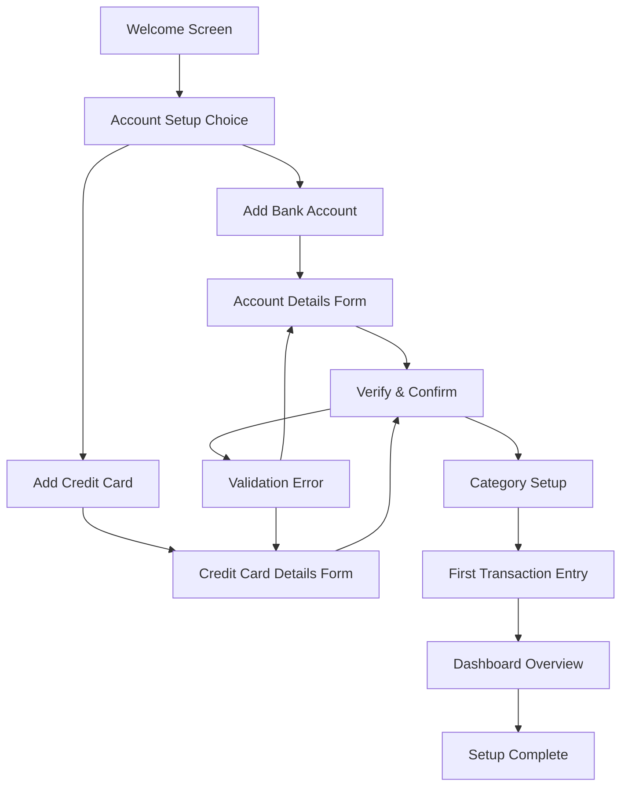
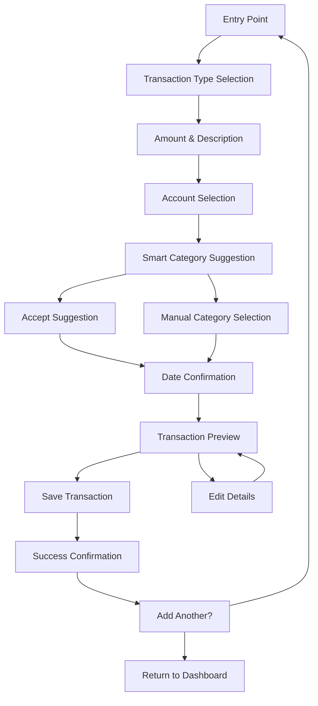
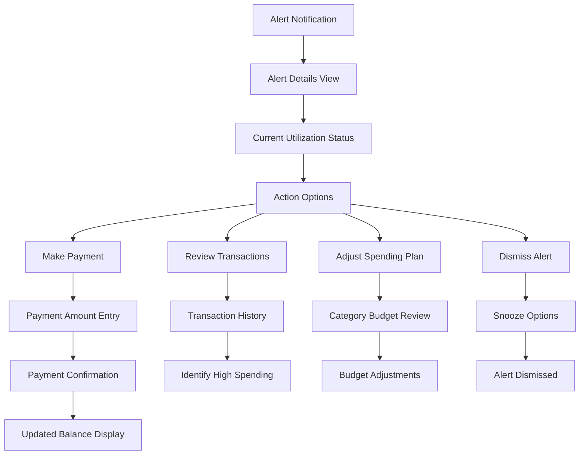
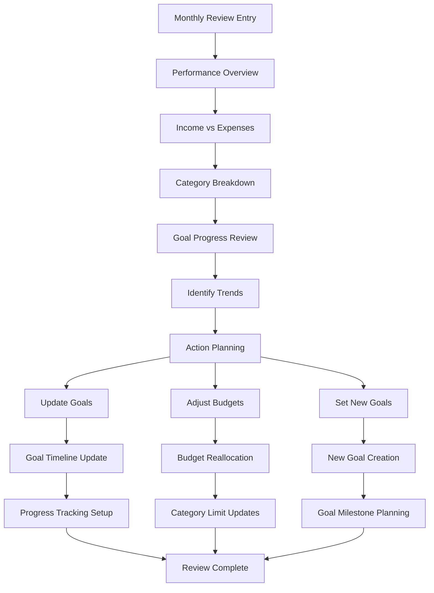

# SalaryMan UI/UX Specification

## Introduction

This document defines the user experience goals, information architecture, user flows, and visual design specifications for SalaryMan's user interface. It serves as the foundation for visual design and frontend development, ensuring a cohesive and user-centered experience.

## Overall UX Goals & Principles

### Target User Personas

**Financial Management Professional:** Working professionals managing complex financial portfolios with multiple bank accounts, credit cards, and income sources. They need comprehensive tracking with detailed analytics and automated alerts to prevent financial missteps while maintaining efficiency in their financial management workflow.

**Multi-Account Power User:** Individuals with diverse financial products (checking, savings, investment accounts, multiple credit cards) who require granular control over categorization, reporting, and goal tracking. They value customization, data export capabilities, and proactive management features.

**Budget-Conscious Planner:** Users focused on expense tracking, spending pattern analysis, and savings goals who benefit from visual insights, alerts for overspending, and tools to understand where their money goes. They need clear financial health indicators and actionable recommendations.

### Usability Goals

- **Immediate Financial Clarity:** Users can understand their complete financial status within 10 seconds of logging in through the dashboard overview
- **Efficient Transaction Management:** Users can add, categorize, and review transactions with minimal clicks and smart defaults based on historical patterns  
- **Proactive Financial Protection:** Users receive timely, actionable alerts that prevent costly mistakes (missed payments, credit limit overages) without notification fatigue
- **Comprehensive Analysis Access:** Users can generate detailed financial reports and insights without requiring advanced technical knowledge
- **Cross-Device Consistency:** Users experience identical functionality and data access across desktop and mobile devices

### Design Principles

1. **Trust Through Transparency** - Every financial calculation, alert, and recommendation includes clear explanations of how it was determined, building user confidence in the system's accuracy
2. **Progressive Disclosure with Context** - Complex features are layered logically, with contextual hints and guidance that reveal advanced functionality as users become more sophisticated
3. **Intelligent Automation with User Control** - The system provides smart defaults and automated processes while always giving users the ability to customize, override, or understand the underlying logic
4. **Clarity Over Complexity** - Financial data presentation prioritizes immediate comprehension over feature density, using visual hierarchy and white space to reduce cognitive load
5. **Proactive Assistance Without Overwhelm** - Alerts and recommendations appear at optimal moments with appropriate urgency levels, helping users stay informed without creating anxiety

### Change Log

| Date | Version | Description | Author |
|------|---------|-------------|---------|
| 2025-08-10 | 1.0 | Initial UI/UX specification creation | Sally (UX Expert) |

## Information Architecture (IA)

### Site Map / Screen Inventory

```mermaid
graph TD
    A[Dashboard] --> B[Accounts]
    A --> C[Transactions]
    A --> D[Analytics]
    A --> E[Alerts]
    A --> F[Settings]
    
    B --> B1[Bank Accounts]
    B --> B2[Credit Cards]
    B --> B3[Add Account]
    B --> B4[Account Details]
    
    C --> C1[Transaction History]
    C --> C2[Add Transaction]
    C --> C3[Categories]
    C --> C4[Recurring Payments]
    
    D --> D1[Spending Analysis]
    D --> D2[Savings Goals]
    D --> D3[Financial Reports]
    D --> D4[Data Export]
    
    E --> E1[Credit Card Alerts]
    E --> E2[Bill Reminders]
    E --> E3[Notification Center]
    E --> E4[Alert Settings]
    
    F --> F1[User Profile]
    F --> F2[Notification Preferences]
    F --> F3[Security Settings]
    F --> F4[Data Management]
```

### Navigation Structure

**Primary Navigation:** Dashboard-first horizontal navigation with five main sections (Dashboard, Accounts, Transactions, Analytics, Alerts, Settings). Each section uses clear, action-oriented labels that directly correspond to user mental models of financial management tasks.

**Secondary Navigation:** Context-sensitive sidebar navigation within each main section, showing relevant subsections and quick actions. For example, within Accounts, users see Bank Accounts, Credit Cards, and Add Account options with visual indicators for alerts or required actions.

**Breadcrumb Strategy:** Hierarchical breadcrumbs for deep navigation paths (e.g., Dashboard > Analytics > Spending Analysis > Category Details) with smart truncation on mobile devices. Breadcrumbs include contextual information like date ranges or account names when relevant.

## User Flows

### New User Onboarding & First Account Setup

**User Goal:** Complete initial setup to begin tracking financial data with minimal friction while ensuring data accuracy.

**Entry Points:** Post-authentication landing page, welcome email links, guided tour prompts

**Success Criteria:** User successfully adds at least one bank account or credit card and completes their first transaction entry within 10 minutes.

#### Flow Diagram

#### Edge Cases & Error Handling:
- Invalid account information with clear guidance on correct format requirements
- Duplicate account detection with options to merge or create separate entries
- Connectivity issues during setup with offline data preservation
- User abandonment with progress saving and resume options
- Data validation failures with contextual help and examples

**Notes:** Onboarding emphasizes security and data accuracy while maintaining momentum. Smart defaults are provided but users can customize all settings immediately or defer to later configuration.

### Daily Transaction Entry & Categorization

**User Goal:** Quickly record financial transactions with accurate categorization and minimal data entry effort.

**Entry Points:** Dashboard quick-add button, mobile app, transaction import, recurring transaction templates

**Success Criteria:** User completes transaction entry in under 30 seconds with automatic categorization accuracy above 80%.

#### Flow Diagram

#### Edge Cases & Error Handling:
- Insufficient account balance warnings with transfer suggestions
- Duplicate transaction detection with merge or separate options
- Category confidence scoring with manual review prompts for low-confidence suggestions
- Transaction splitting for multiple categories with percentage allocation
- Receipt photo attachment failures with retry mechanisms

**Notes:** Flow prioritizes speed while maintaining accuracy through progressive disclosure. Advanced features like transaction splitting are available but don't interrupt the primary flow.

### Credit Card Alert Response & Management

**User Goal:** Respond to credit card usage alerts and take appropriate financial actions to maintain healthy credit utilization.

**Entry Points:** Push notifications, email alerts, dashboard alert widgets, dedicated alerts page

**Success Criteria:** User acknowledges alert and takes corrective action within 2 minutes of alert interaction.

#### Flow Diagram

#### Edge Cases & Error Handling:
- Payment processing failures with alternative payment methods
- Outdated balance information with refresh and sync options
- Multiple simultaneous alerts with consolidated view and bulk actions
- Network connectivity issues with offline action queuing
- False alerts due to pending transactions with explanation and correction options

**Notes:** Alert responses emphasize immediate clarity about financial status and provide actionable next steps. Users can customize alert thresholds and notification preferences at any point in the flow.

### Monthly Financial Review & Goals Tracking

**User Goal:** Review monthly financial performance, assess goal progress, and adjust financial strategy based on comprehensive data analysis.

**Entry Points:** Monthly email reports, dashboard analytics widgets, scheduled review reminders, goal milestone notifications

**Success Criteria:** User completes monthly review and updates at least one financial goal or budget allocation within 15 minutes.

#### Flow Diagram

#### Edge Cases & Error Handling:
- Insufficient data for meaningful analysis with guidance on data collection improvements
- Goal deadline conflicts with realistic timeline suggestions and adjustments
- Budget allocation errors exceeding income with balancing recommendations
- Seasonal spending pattern recognition with adjusted projections
- External financial changes requiring goal recalibration with impact analysis

**Notes:** Monthly review flow balances comprehensive analysis with actionable insights. Users can drill down into any data point for detailed investigation while maintaining focus on forward-looking financial planning.

## Wireframes & Mockups

**Primary Design Files:** Figma workspace with Shadcn UI component library integration for design-development consistency and accessibility compliance.

### Key Screen Layouts

#### Dashboard Overview

**Purpose:** Provide immediate financial status clarity with actionable insights and quick access to critical functions.

**Key Elements:**
- Financial health score with trend indicator and explanation tooltip
- Account balance summary cards with color-coded status indicators (positive/negative/alert)
- Credit card utilization widget with visual progress bars and threshold warnings
- Recent transactions list (5 most recent) with category icons and quick-edit options
- Alert notification panel with priority-based visual hierarchy
- Quick action floating button for add transaction with context-sensitive options

**Interaction Notes:** Dashboard uses progressive disclosure with expandable cards for detailed views. All financial figures include hover/tap explanations of calculations. Quick actions adapt based on user's most frequent activities and current financial status.

**Design File Reference:** Dashboard_Overview_Desktop.fig / Dashboard_Overview_Mobile.fig

#### Account Management

**Purpose:** Comprehensive view and management of all financial accounts with clear status indicators and streamlined account operations.

**Key Elements:**
- Account type tabs (Bank Accounts / Credit Cards) with notification badges
- Account cards showing balance, account type, and last activity with status indicators
- Add account floating action button with wizard-style guided setup
- Account detail drill-down with transaction history and account-specific analytics
- Bulk action toolbar for account management operations
- Balance trend sparklines for quick visual assessment

**Interaction Notes:** Account cards use consistent visual language with status-appropriate colors and icons. Editing flows use inline editing where possible with confirmation for destructive actions. Mobile view stacks cards vertically with swipe actions for common operations.

**Design File Reference:** Accounts_Management_Desktop.fig / Accounts_Mobile.fig

#### Transaction Entry Form

**Purpose:** Streamlined transaction recording with intelligent categorization and minimal required input fields.

**Key Elements:**
- Smart amount input with currency formatting and calculation support
- Contextual account selection with balance display and insufficient funds warnings
- Category suggestion chips with confidence indicators and manual override options
- Date picker with smart defaults (today) and recent date quick-select
- Description field with autocomplete from transaction history
- Optional receipt photo attachment with drag-and-drop interface
- Transaction preview panel with balance impact calculation

**Interaction Notes:** Form uses progressive enhancement with basic functionality working without JavaScript. Smart suggestions appear as users type with visual confidence indicators. Mobile version optimizes for thumb navigation and native input types.

**Design File Reference:** Transaction_Entry_Form.fig / Transaction_Mobile_Entry.fig

#### Analytics Dashboard

**Purpose:** Financial data visualization with interactive charts and drill-down capabilities for comprehensive spending analysis.

**Key Elements:**
- Time period selector with preset ranges (month/quarter/year) and custom date picker
- Income vs. expenses trend chart with hover details and comparison indicators
- Category breakdown pie chart with interactive segments and percentage details
- Spending pattern calendar heatmap with daily/weekly/monthly views
- Goal progress visualization with timeline and milestone indicators
- Export functionality with format selection and custom report builder

**Interaction Notes:** All charts support touch/click interactions for drilling down into specific data points. Responsive design transforms complex charts into mobile-optimized views. Data tooltips provide context and explanations for all calculated metrics.

**Design File Reference:** Analytics_Dashboard.fig / Analytics_Mobile_Charts.fig

#### Alert Management Center

**Purpose:** Centralized notification management with clear priority hierarchy and streamlined action workflows.

**Key Elements:**
- Alert priority tabs (Critical/High/Medium/Low) with visual count indicators
- Alert cards with context-aware action buttons and dismissal options
- Notification preference settings with granular control per alert type
- Alert history with search and filtering capabilities
- Snooze and scheduling options with intelligent reminder timing
- Bulk action toolbar for managing multiple alerts simultaneously

**Interaction Notes:** Alert cards use consistent visual language with color-coding for urgency levels. Action buttons adapt based on alert type with primary actions prominently displayed. Mobile version uses card stack interface with swipe gestures for common actions.

**Design File Reference:** Alert_Management.fig / Alert_Mobile_Interface.fig

## Component Library / Design System

**Design System Approach:** Extension of Shadcn UI + Tailwind CSS v4 foundation with custom financial-specific components. Maintains Shadcn's accessibility standards while adding domain-specific functionality for financial data display and interaction patterns.

### Core Components

#### Currency Display Component

**Purpose:** Consistent formatting and display of monetary values across all interfaces with proper localization and accessibility support.

**Variants:** 
- Standard currency display with symbol and formatting
- Compact display for data-dense interfaces
- Large display for emphasis (dashboard totals, alerts)
- Trend display with directional indicators (↑↓) and color coding

**States:** 
- Positive values (green text, optional + prefix)
- Negative values (red text with - prefix)  
- Zero/neutral values (neutral gray)
- Loading state with skeleton placeholder
- Error state with fallback display

**Usage Guidelines:** Always include proper ARIA labels for screen readers. Use consistent decimal precision (2 places for USD). Implement proper number formatting with locale-aware thousand separators.

#### Financial Status Indicator

**Purpose:** Visual communication of financial health, account status, and alert conditions with clear semantic meaning.

**Variants:**
- Health score indicator with color gradient and percentage
- Account status badges (active, overdrawn, approaching limit)
- Alert level indicators (info, warning, critical, success)
- Progress indicators for goals and budgets

**States:**
- Healthy/positive (green with checkmark icon)
- Warning/attention needed (amber with warning icon)
- Critical/immediate action (red with alert icon)
- Neutral/informational (blue with info icon)
- Disabled/inactive (gray with appropriate iconography)

**Usage Guidelines:** Always pair color coding with icons for accessibility. Provide hover/focus states that explain the status meaning. Use consistent color semantics across all financial contexts.

#### Alert Notification Card

**Purpose:** Standardized notification presentation with clear hierarchy, actionable content, and appropriate urgency signaling.

**Variants:**
- Inline dashboard alerts with summary view
- Full-page alert details with expanded context
- Toast notifications for real-time alerts
- Email/push notification formatting templates

**States:**
- Unread (bold text, colored border, attention indicators)
- Read (standard styling, reduced visual weight)
- Acknowledged (checkmark, reduced opacity)
- Snoozed (clock icon, muted colors)
- Expired/resolved (crossed out, archived state)

**Usage Guidelines:** Use progressive disclosure - summary first, details on interaction. Ensure keyboard navigation and screen reader compatibility. Provide clear action hierarchy with primary/secondary button patterns.

#### Financial Chart Container

**Purpose:** Responsive wrapper for financial data visualizations with consistent styling, legends, and interaction patterns.

**Variants:**
- Line charts for trend analysis
- Pie/donut charts for category breakdowns  
- Bar charts for comparative analysis
- Calendar heatmaps for spending patterns

**States:**
- Loading with skeleton chart placeholders
- Data loaded with full interactivity
- Empty state with guidance for data collection
- Error state with retry mechanisms
- Filtered state showing active filter indicators

**Usage Guidelines:** Maintain consistent color palette across all chart types. Provide alternative text descriptions for accessibility. Ensure touch-friendly interaction targets on mobile devices.

#### Smart Form Input

**Purpose:** Enhanced form inputs with financial validation, formatting, and intelligent suggestions tailored for monetary data entry.

**Variants:**
- Currency amount input with automatic formatting
- Account selector with balance display
- Category selector with usage statistics
- Date picker optimized for financial transactions

**States:**
- Empty with placeholder guidance
- Valid input with positive confirmation
- Invalid with specific error messaging
- Loading during validation/suggestion fetching
- Disabled for read-only contexts

**Usage Guidelines:** Provide real-time validation feedback without being intrusive. Use progressive enhancement for JavaScript-dependent features. Ensure form accessibility with proper labeling and error associations.

## Branding & Style Guide

### Visual Identity

**Brand Guidelines:** Professional financial interface emphasizing trust, clarity, and user empowerment. Visual language balances approachability with the gravitas appropriate for financial data management.

### Color Palette

| Color Type | Hex Code | Usage |
|------------|----------|--------|
| Primary | #2563eb (Blue 600) | Primary actions, links, brand elements |
| Secondary | #64748b (Slate 500) | Secondary text, subdued elements |
| Accent | #0ea5e9 (Sky 500) | Interactive elements, highlights |
| Success | #10b981 (Emerald 500) | Positive feedback, confirmations, income |
| Warning | #f59e0b (Amber 500) | Cautions, important notices, approaching limits |
| Error | #ef4444 (Red 500) | Errors, destructive actions, overdrafts |
| Neutral | #f8fafc to #0f172a (Slate scale) | Text, borders, backgrounds |

### Typography

#### Font Families
- **Primary:** Inter (clean, highly legible for financial data)
- **Secondary:** System UI fallback (platform-native feel)
- **Monospace:** JetBrains Mono (tabular data, account numbers)

#### Type Scale

| Element | Size | Weight | Line Height |
|---------|------|---------|-------------|
| H1 | 2.25rem (36px) | 700 (Bold) | 1.2 |
| H2 | 1.875rem (30px) | 600 (Semi-bold) | 1.3 |
| H3 | 1.5rem (24px) | 600 (Semi-bold) | 1.4 |
| Body | 1rem (16px) | 400 (Regular) | 1.5 |
| Small | 0.875rem (14px) | 400 (Regular) | 1.4 |

### Iconography

**Icon Library:** Lucide React icons for consistency with Shadcn UI ecosystem, supplemented with custom financial icons for domain-specific concepts.

**Usage Guidelines:** Use outline style for consistency. Maintain 24px base size with 16px and 32px variants. Ensure icons have semantic meaning and include proper ARIA labels.

### Spacing & Layout

**Grid System:** 12-column responsive grid with consistent breakpoints aligned with Tailwind CSS defaults.

**Spacing Scale:** Tailwind's default spacing scale (0.25rem increments) with emphasis on 4, 6, 8, 12, and 16 unit values for major layout elements.

## Accessibility Requirements

### Compliance Target

**Standard:** WCAG 2.1 AA compliance with enhanced financial data accessibility considerations for users managing critical financial information.

### Key Requirements

**Visual:**
- Color contrast ratios: Minimum 4.5:1 for normal text, 3:1 for large text
- Focus indicators: Visible 2px outline with sufficient contrast on all interactive elements
- Text sizing: Scalable to 200% without horizontal scrolling or loss of functionality

**Interaction:**
- Keyboard navigation: Full application functionality accessible via keyboard with logical tab order
- Screen reader support: Semantic HTML structure with comprehensive ARIA labels and descriptions
- Touch targets: Minimum 44px for mobile interactions with adequate spacing

**Content:**
- Alternative text: Descriptive alt text for all charts and financial visualizations
- Heading structure: Logical heading hierarchy (h1-h6) for screen reader navigation
- Form labels: Explicit labels and error associations for all form inputs

### Testing Strategy

Regular accessibility auditing using automated tools (axe-core) and manual testing with screen readers (NVDA, JAWS, VoiceOver). User testing with individuals who use assistive technologies for financial management tasks.

## Responsiveness Strategy

### Breakpoints

| Breakpoint | Min Width | Max Width | Target Devices |
|------------|-----------|-----------|----------------|
| Mobile | 320px | 767px | Smartphones, small tablets |
| Tablet | 768px | 1023px | Tablets, small laptops |
| Desktop | 1024px | 1439px | Standard desktop monitors |
| Wide | 1440px | - | Large monitors, ultrawide displays |

### Adaptation Patterns

**Layout Changes:** Desktop dashboard uses multi-column layout with sidebar navigation. Tablet and mobile collapse to single-column with tab-based navigation and collapsible sections.

**Navigation Changes:** Desktop horizontal navigation becomes mobile hamburger menu with slide-out drawer. Context-sensitive actions move to floating action buttons on mobile.

**Content Priority:** Progressive disclosure hides secondary information on smaller screens. Critical financial data remains prominently visible with drill-down access to detailed views.

**Interaction Changes:** Desktop hover states become mobile tap states. Swipe gestures added for mobile card navigation and quick actions.

## Animation & Micro-interactions

### Motion Principles

Subtle, purposeful animations that enhance usability without causing distraction from financial data. Motion provides feedback for user actions and guides attention to important changes in financial status.

### Key Animations

- **Balance Updates:** Smooth number transitions (300ms ease-out) when balances change
- **Chart Interactions:** Gentle hover effects (150ms ease-in-out) for data point exploration  
- **Alert Notifications:** Attention-getting but non-intrusive slide-in animations (200ms ease-out)
- **Form Validation:** Immediate feedback animations (100ms ease-in) for input validation
- **Page Transitions:** Subtle fade transitions (250ms ease-in-out) between major sections

## Performance Considerations

### Performance Goals

- **Page Load:** Initial dashboard load under 2 seconds on 3G connections
- **Interaction Response:** UI feedback within 100ms for all user interactions
- **Animation FPS:** Maintain 60fps for all animations and transitions

### Design Strategies

Optimize images and charts for web delivery. Use lazy loading for below-fold content. Implement efficient caching strategies for frequently accessed financial data. Minimize animation complexity to maintain performance on lower-end devices.

## Next Steps

### Immediate Actions

1. Create detailed Figma designs for all core screens using established component library
2. Develop interactive prototypes for critical user flows (onboarding, transaction entry, alert management)  
3. Conduct usability testing with target personas using clickable prototypes
4. Refine component specifications based on user feedback and technical feasibility
5. Prepare design tokens and assets for frontend development handoff

### Design Handoff Checklist

- [x] All user flows documented
- [x] Component inventory complete  
- [x] Accessibility requirements defined
- [x] Responsive strategy clear
- [x] Brand guidelines incorporated
- [x] Performance goals established
